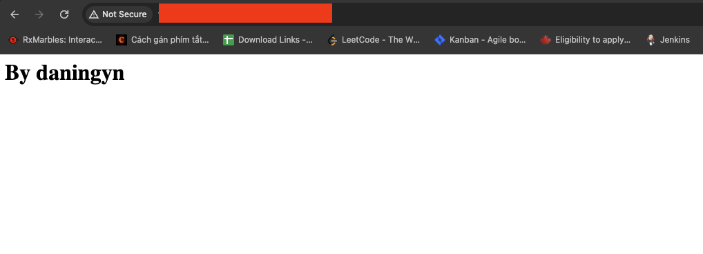
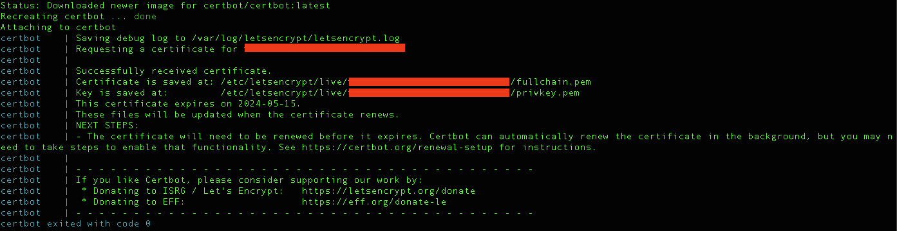

# Secure your RPC

This repo will help you to secure RPC which adapts the node's requirement

## Prerequisite

- Docker
- Docker-compose
- Git

## Installation

### Git

```bash
sudo apt update
sudo apt install git
```

### Docker

```bash
sudo apt install apt-transport-https ca-certificates curl software-properties-common
curl -fsSL https://download.docker.com/linux/ubuntu/gpg | sudo apt-key add -
sudo add-apt-repository "deb [arch=amd64] https://download.docker.com/linux/ubuntu focal stable"
apt-cache policy docker-ce
sudo apt install docker-ce
```

Check your docker to see if it's running

```bash
sudo systemctl status docker
```

You should see


### Docker Compose

```bash
sudo curl -L "https://github.com/docker/compose/releases/download/1.29.2/docker-compose-$(uname -s)-$(uname -m)" -o /usr/local/bin/docker-compose
sudo chmod +x /usr/local/bin/docker-compose
```

Check docker compose is live
```bash
docker-compose --version
```

You should see
```
Output
docker-compose version 1.29.2, build 5becea4c
```


## Usage

- Get your DNS

- For me, I use contabo vps so I get DNS from url `https://my.contabo.com/rdns` -- Please do not use IP because too hard to secure bare IP

- Clone this repo
```bash
git clone https://github.com/daningyn/ssl-rpc-host.git
cd ssl-rpc-host
```

- Generate config (MUST DO)
```bash
npm run generate -- --vps {your dns} --email {your email}
```

- Build non-ssl server
```bash
docker-compose -f docker-compose-temp-server.yml up -d --build
```

- Enter the domain `http://{your dns}`, you should see it's live


- Build ssl to secure your url
```bash
docker-compose -f docker-compose-certbot.yml up
```

- You should see result like below


- Build https app
```bash
docker-compose up -d --build
```

- For now, I built configuration for DYM rollapp (ports: 26657 -> rpc, 1317 -> rest endpoint, 8545 -> rpc endpoint)

- Check with url `https://dns`, you should see


- If you reached this step, Congratulation! You done.

## Link for DYM RollApp

- rpc: `https://{your dns}/rpc`
- rest endpoint: `https://{your dns}/rest`
- rpc endpoint: `https://{your dns}/rpcEndPoint`

## Contributing

Pull requests are welcome. For major changes, please open an issue first
to discuss what you would like to change.

Please make sure to update tests as appropriate.

## License

[MIT](https://choosealicense.com/licenses/mit/)
